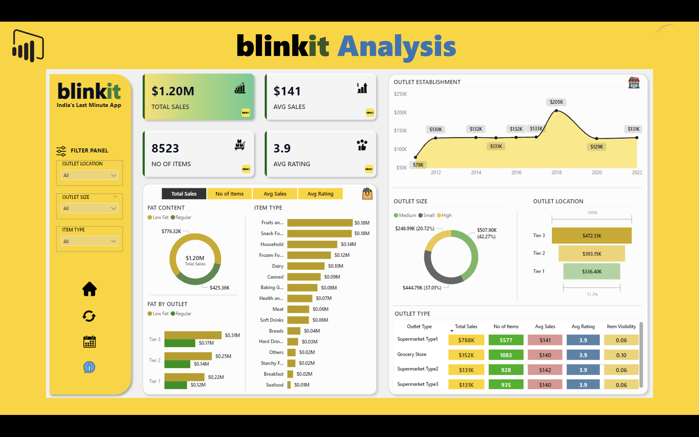

# Blinkit Sales Dashboard – Power BI Project

📊 This is an end-to-end data analysis and visualization project built using Power BI. It analyzes sales data from a grocery delivery platform (modeled on Blinkit) to deliver insights into product performance, outlet efficiency, customer preferences, and more.

The goal of this project is to demonstrate how business intelligence tools like Power BI can turn raw data into meaningful, actionable insights for strategic decision-making in a retail environment.

---
## 📸 Dashboard Preview

---

## 🔍 Project Overview

In a competitive retail environment, data-driven decision-making is essential. This project simulates a real-world scenario where the management of a fast-growing online grocery delivery company (like Blinkit) wants to analyze its sales and outlet performance across locations.

Using a structured dataset and Power BI, this dashboard provides key insights such as:

- Which product categories generate the most sales
- How outlet location and type affect performance
- The impact of item visibility and weight on sales
- Trends in customer ratings across products

The dashboard is fully interactive, with slicers and filters for exploring trends across multiple dimensions such as location, item type, and outlet size.

---

## 📂 Files Included

- `blinkit_dashboard.pbix` – Main Power BI report file
- `blinkit_data.xlsx` – Source dataset used for report
- `assets/dashboard.png` – Final dashboard screenshot

---

## 📈 Key Features

- Sales performance by item type and location
- Item visibility and weight correlation
- Outlet-wise revenue comparison
- Ratings analysis and filtering options

---

## 🛠 Tools Used

- Microsoft Power BI
- Excel (data preprocessing)

---
